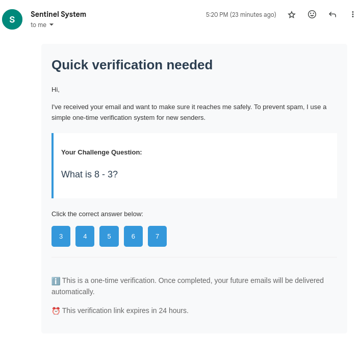

# Email Sentinel System 🛡

This is a completely unserious prototype implementing [this tweet](https://x.com/francoisfleuret/status/1848964006632980733):


## What it does

1. New person emails you
2. They get a reply with a simple math question
3. If they answer correctly:
   - Their email gets delivered
   - They're whitelisted for future emails
4. If they don't answer or get it wrong, the email stays blocked

## How it looks


## Is it good?

No, and it's littered with bugs. Also it's beyond me why Email Workers don't support SRS forwarding for some reason.

## Setup

1. Create two KV namespaces in Cloudflare:
   - `CHALLENGE_STORE`: For pending challenges
   - `WHITELIST_STORE`: For approved senders

2. Edit these constants in the code:
```typescript
const SENTINEL_EMAIL = 'sentinel@yourdomain.com';
const TARGET_EMAIL = 'your@email.com';
const WORKER_ROUTE = 'your-worker.workers.dev';
```

3. Deploy to Cloudflare Workers with Email Workers enabled and your KV namespaces bound

That's it! New senders will now need to solve a math problem to reach you.
